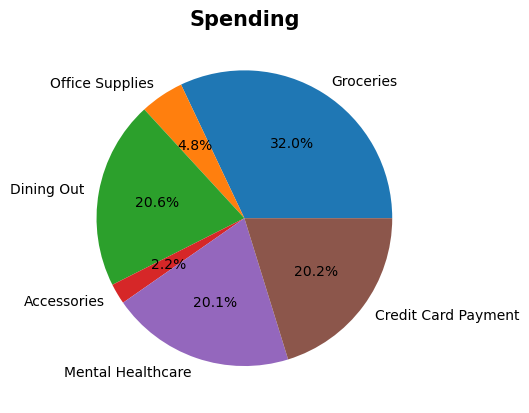

# Python Code

```python
import csv
import pandas as pd
import datetime
import matplotlib.pyplot as plt

def process_csv(file):
    df = pd.read_csv(file) # load the .csv and converts it into a DataFrame
    df = df.iloc[:, 0:4] # in case the .csv has more than four columns, the program is hardcoded to chop it down into four
    df = df.dropna() # in case there are extra rows in the DataFrame, this removes them
    df['Amount'] = df['Amount'].astype(float) # formats the 'Amount' column as floats

    for cell in range(len(df['Date'])):
        current_cell = df.loc[cell, 'Date']
        # print(current_cell)
        if len(current_cell) == 5:
            current_cell = pd.to_datetime(df.loc[cell, 'Date'] + '/2025') # currently is hardcoded to add the year 2025 to the date
            current_cell = current_cell.strftime("%x") # format the dates to be MM/DD/YY
            # current_cell = pd.to_datetime(current_cell) # uncomment this line to convert to DateTime format
            df.loc[cell, 'Date'] = current_cell
        else:
            current_cell = pd.to_datetime(df.loc[cell, 'Date'])
            current_cell = current_cell.strftime("%x")
            df.loc[cell, 'Date'] = current_cell
    return df

def combine_slices(input_df):
    combined_data = {}
    for idx in range(len(input_df.iloc[:, 2])):
        current_category = input_df.iloc[idx, 2]
        if current_category not in combined_data:
            amount_list = 0
            combined_data[current_category] = amount_list
            # amount_list.append(pos_df.iloc[idx,3])
        for key in combined_data:
            if key == current_category:
                combined_data[current_category] += input_df.iloc[idx,3]
    merged_values = combined_data.values()
    merged_labels = combined_data.keys()
    return combined_data

new_file = input("Welcome! Please input the file name(must be .csv) you'd like to analyze: ")
current_df = process_csv(new_file)

add_new = True
while add_new:
    add_true = input("Add another file(y/n)?")
    if add_true == 'y':
        combine_df = process_csv(input("Enter a .csv file:"))
        combined_df = combine_df.merge(current_df, how = 'outer')
        current_df = combined_df.copy()
        add_true = input("Add another file(y/n)?")
    if add_true == 'n':
        add_new = False
        combined_df = current_df
current_df = combined_df
repeat = True
while repeat:
    flow = input("Would you like to look at spending(s) or income(i)?")
    if flow == "i":
        current_df = current_df[current_df['Amount'] > 0]
        repeat = False
        flow_name = "Income"
    elif flow == "s":
        current_df.loc[:, "Amount"] = -1 * current_df.loc[:, "Amount"]
        # current_df = df.reset_index()
        # current_df = current_df.iloc[:, 1:]
        current_df = current_df[current_df['Amount'] > 0]
        flow_name = "Spending"
        repeat = False
    else:
        print("Invalid input, dude!")

current_df = current_df.reset_index()
current_df = current_df.iloc[:, 1:]
filter_more_categories_valid = True
while filter_more_categories_valid == True:
    date_range_valid = input("Would you like to filter out a category(y/n)? \
    This question will repeat if you type 'y' and give an input to the next question:")
    if date_range_valid == 'y':
        filtered_category = input("Enter the category you want to filter out:")
        fresh_df = []
        for cell in range(len(current_df)):
            if current_df.loc[cell, 'Category'] != filtered_category:
                current_cell = current_df.loc[cell, 'Category']
                fresh_df.append(current_df.loc[cell])
        fresh_df = pd.DataFrame(fresh_df)
        continue
        current_df = fresh_df
    elif date_range_valid == 'n':
        filter_more_categories_valid = False
    else:
        print("Invalid input!")
        continue
current_df = fresh_df
current_df = pd.DataFrame(current_df)
current_df = current_df.reset_index()
current_df = current_df.iloc[:, 1:]
date_range_valid = False
while date_range_valid == False:
    date_range_valid = input("Would you like to set a date range(y/n)? ")
    if date_range_valid == 'y':

        min_date = input('Enter the minimum date you want to filter your data(MM/DD/YYYY):')
        max_date = input('Enter the maximum date you want to filter your data(MM/DD/YYYY:')

        max_date = pd.to_datetime(max_date)
        min_date = pd.to_datetime(min_date)

        current_df = current_df[min_date <= pd.to_datetime(current_df['Date'], format = 'mixed')]
        current_df = current_df[max_date >= pd.to_datetime(current_df['Date'], format = 'mixed')]

dict_here = combine_slices(current_df)
print()
plt.pie(dict_here.values(), labels=dict_here.keys(), autopct='%1.1f%%')
plt.title(flow_name, fontsize=15, fontweight='bold')
plt.show()
print()
empty_df_for_format = pd.DataFrame({
    "Amount": ['-'],
    "Category": ['-'],
    "Description": ['-'],
    "Date": ['-']
})

summed_df = pd.DataFrame({
    "Category": dict_here.keys(),
    "Amount": dict_here.values()
})

df_list = [current_df,empty_df_for_format,  summed_df]

current_df = pd.concat(df_list)
current_df = current_df.reset_index()
current_df = current_df.iloc[:, 1:]
current_df
```

    Welcome! Please input the file name(must be .csv) you'd like to analyze:  Sheet1.csv
    Add another file(y/n)? y
    Enter a .csv file: testing.csv
    Add another file(y/n)? n
    Would you like to look at spending(s) or income(i)? s
    Would you like to filter out a category(y/n)?     This question will repeat if you type 'y' and give an input to the next question: y
    Enter the category you want to filter out: Rent
    Would you like to filter out a category(y/n)?     This question will repeat if you type 'y' and give an input to the next question: n
    Would you like to set a date range(y/n)?  n
    

    
    


    

    


    
    


<div>
<style scoped>
    .dataframe tbody tr th:only-of-type {
        vertical-align: middle;
    }

    .dataframe tbody tr th {
        vertical-align: top;
    }

    .dataframe thead th {
        text-align: right;
    }
</style>
<table border="1" class="dataframe">
  <thead>
    <tr style="text-align: right;">
      <th></th>
      <th>Date</th>
      <th>Description</th>
      <th>Category</th>
      <th>Amount</th>
    </tr>
  </thead>
  <tbody>
    <tr>
      <th>0</th>
      <td>03/29/25</td>
      <td>EXEMPLAR E DREAMER 1234 WOODER SAM S #421 GEOR...</td>
      <td>Groceries</td>
      <td>11.07</td>
    </tr>
    <tr>
      <th>1</th>
      <td>03/29/25</td>
      <td>TARGET</td>
      <td>Office Supplies</td>
      <td>4.58</td>
    </tr>
    <tr>
      <th>2</th>
      <td>03/30/25</td>
      <td>UI CHAMPAG STAT CENTR GEORGIA ST</td>
      <td>Dining Out</td>
      <td>10.5</td>
    </tr>
    <tr>
      <th>3</th>
      <td>04/04/25</td>
      <td>UI SYDNEY DINING GEORGIA ST</td>
      <td>Dining Out</td>
      <td>13.4</td>
    </tr>
    <tr>
      <th>4</th>
      <td>04/05/25</td>
      <td>04/05 POS 1765:PURCHASE              04/05/25 ...</td>
      <td>Groceries</td>
      <td>83.09</td>
    </tr>
    <tr>
      <th>5</th>
      <td>04/07/25</td>
      <td>WINTR BAR WHITE RESTAURAN GEORGIA ST</td>
      <td>Dining Out</td>
      <td>33.04</td>
    </tr>
    <tr>
      <th>6</th>
      <td>04/10/25</td>
      <td>BEACHY DIAMO INC GEORGIA ST</td>
      <td>Accessories</td>
      <td>10.5</td>
    </tr>
    <tr>
      <th>7</th>
      <td>04/11/25</td>
      <td>UI CHAMPAG STAT CENTR GEORGIA ST</td>
      <td>Dining Out</td>
      <td>11.55</td>
    </tr>
    <tr>
      <th>8</th>
      <td>04/15/25</td>
      <td>ALEC'S EMPANADA CHASAS GEORGIA ST</td>
      <td>Dining Out</td>
      <td>18.43</td>
    </tr>
    <tr>
      <th>9</th>
      <td>04/18/25</td>
      <td>04/18 DEBITCARD 1845:PURCHASE GEASGFD.CO    NY</td>
      <td>Mental Healthcare</td>
      <td>94.09</td>
    </tr>
    <tr>
      <th>10</th>
      <td>04/21/25</td>
      <td>04/21 Web Branch:UWCU VISA PAYMENT XX-7786</td>
      <td>Credit Card Payment</td>
      <td>94.64</td>
    </tr>
    <tr>
      <th>11</th>
      <td>04/21/25</td>
      <td>TARGET</td>
      <td>Office Supplies</td>
      <td>17.86</td>
    </tr>
    <tr>
      <th>12</th>
      <td>04/25/25</td>
      <td>04/25 POS 1845:PURCHASE              04/25/25 ...</td>
      <td>Groceries</td>
      <td>55.85</td>
    </tr>
    <tr>
      <th>13</th>
      <td>04/29/25</td>
      <td>04/29 DEBITCARD 1832:PURCHASE Georgia</td>
      <td>Dining Out</td>
      <td>9.5</td>
    </tr>
    <tr>
      <th>14</th>
      <td>-</td>
      <td>-</td>
      <td>-</td>
      <td>-</td>
    </tr>
    <tr>
      <th>15</th>
      <td>NaN</td>
      <td>NaN</td>
      <td>Groceries</td>
      <td>150.01</td>
    </tr>
    <tr>
      <th>16</th>
      <td>NaN</td>
      <td>NaN</td>
      <td>Office Supplies</td>
      <td>22.44</td>
    </tr>
    <tr>
      <th>17</th>
      <td>NaN</td>
      <td>NaN</td>
      <td>Dining Out</td>
      <td>96.42</td>
    </tr>
    <tr>
      <th>18</th>
      <td>NaN</td>
      <td>NaN</td>
      <td>Accessories</td>
      <td>10.5</td>
    </tr>
    <tr>
      <th>19</th>
      <td>NaN</td>
      <td>NaN</td>
      <td>Mental Healthcare</td>
      <td>94.09</td>
    </tr>
    <tr>
      <th>20</th>
      <td>NaN</td>
      <td>NaN</td>
      <td>Credit Card Payment</td>
      <td>94.64</td>
    </tr>
  </tbody>
</table>
</div>


