# .csv Formatting

My program is currently pretty finicky. There *needs* to be **four** columns labled *exactly* as shown, with the data in the 'Amount' column in a *number* format (if you see a dollar sign or comma in that column, my program will crash). 

To get a .csv like this(opened in a Jupyter Notebook) maybe a little less painfully, follow these instructions(specific to UWCU's Personal Statements and VISA's Credit Card Statements):

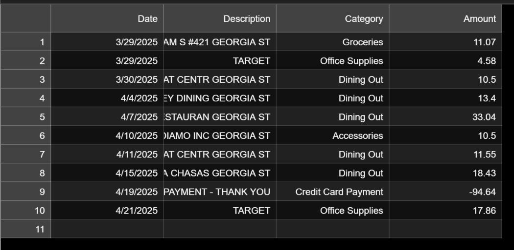

Excel and Adobe Acrobat have features that allows the conversion of a screenshot of a statement and put it into a .csv file. Google Sheets does work, though: look at the instructions that follow.
 
 

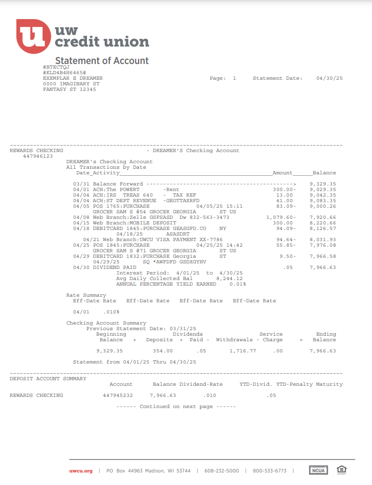
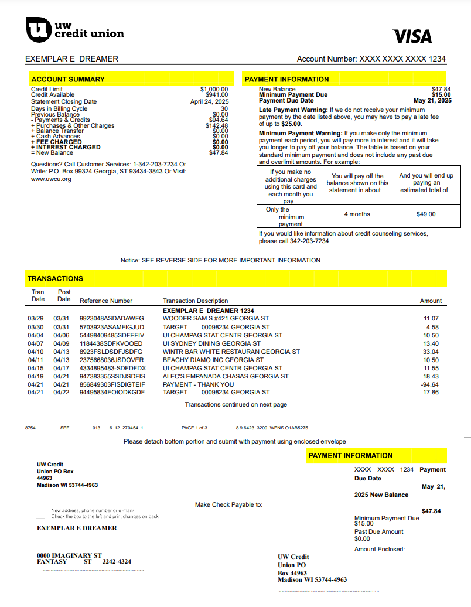

 
 
You can use the reference workbook I've made for you(reference_sheet.xlxs) as a template.

<h3 style="color:LightSeaGreen"> <u>.csv building: Excel Only</u></h3>

For some reason, the following method only works well for the credit card (right) image - the Personal Statement goes wonky.
<h4>Step 1</h4>Crop the image so it only has the relevant information for this project:
 
 

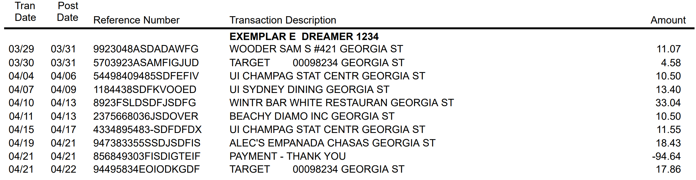

<h4>Step 2</h4>Open a blank workbook in Excel and select 'Picture from Clipboard' from Data -> From Picture:
 
 

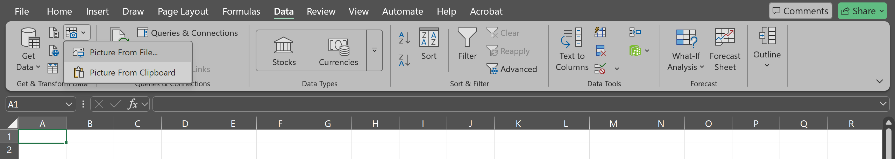

<h4>Step 3</h4>Follow the prompts from the following popout menu ensuring the data is correct before inserting it into the workbook.

 
 

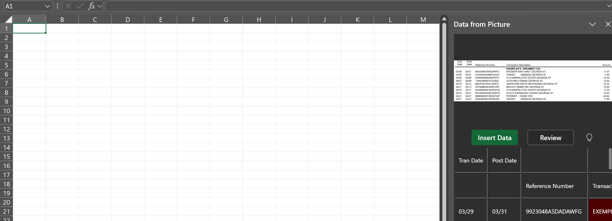

<h4>Step 4</h4>Remove any extra columns by tapping the letter of each column you want to get rid of(this image is a good reminder to format your Date column as dates using the Date Format tool:
 
 

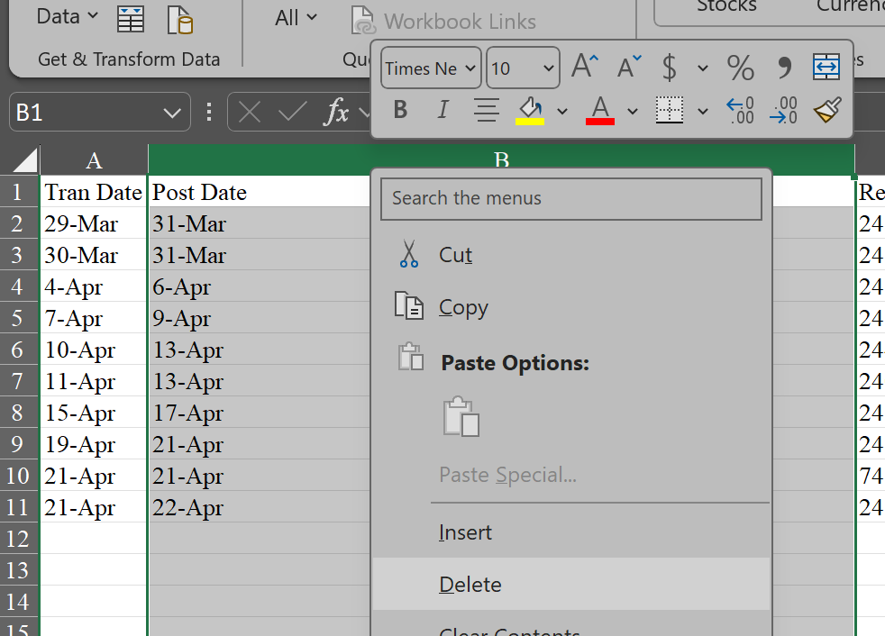

<h4>Step 5</h4>To easily assign categories to a column, paste a list of categories(I've provided a .csv of UWCU's categories as categories.csv) into a separate column, select the third column from the left, and go to Data -> Data Tools -> Data Validation as shown:
 
 

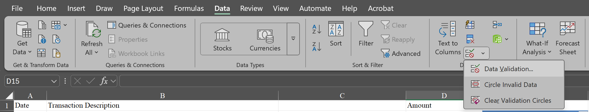

<h4>Step 6</h4>Choose 'List' from 'Allow:' and click the up arrow after 'Source', which will ask for a range(you can click the entire column, drag to select, or type it in):
 
 

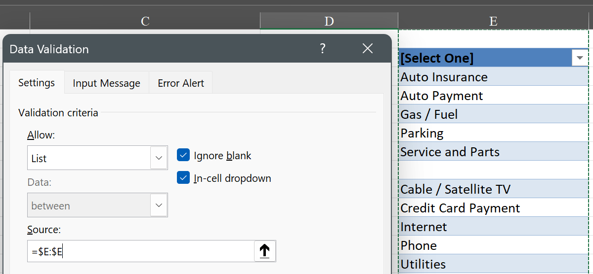

<h4>Step 7</h4>Now you can either start typing, scroll through the menu, and/or click the down arrow in the box that will appear to the right of the cell after selecting it:
 
 

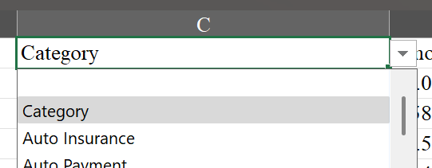

<h4>Step 8</h4>Make sure to delete the list of categories and rename the top rows to 'Date', 'Description', 'Category', and 'Amount'. It's very inportant the 'Date' column is formatted as a date and the 'Amount' column has proper positive and negative values(initially, any negative signs appear *after* the number, and not before. Splitting the column/cells might have fixed this already.) You should end up with a sheet as shown:

**Note:** UWCU's credit card statements list transactions as positive values, as opposed to UWCU's Personal Statements, which list them as negative values. My program interprets negative values as spending and positive values as income.

Use the cell function in the workbook =-C1(make sure to replace 'C1' with the right cell) to flip its sign.
 
 

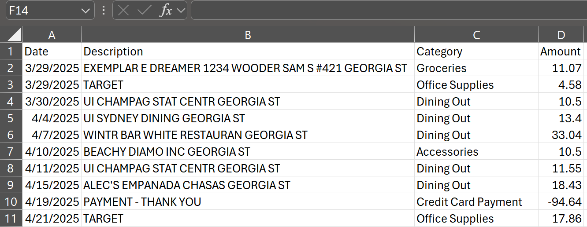

<h4>Step 9</h4>Click 'File' in the top left, and go to 'Save As' to save the workbook as a CSV UTF-8(Comma Delimited)(*.csv) file in the folder where this notebook is:
 
 

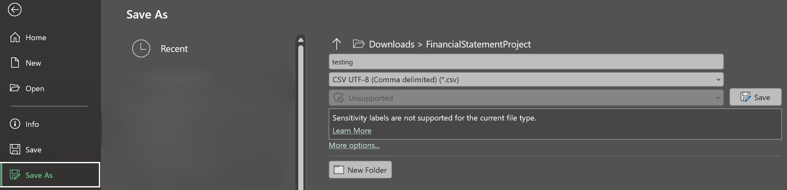

You can rename the file for easier typing, or paste the name into the program.
<h3 style="color:LightSeaGreen"> <u>.csv building: Adobe Acrobat and Excel/Google Sheets</u></h3>
<h4>Step 1</h4>
For the Personal Statement, open the unzoomed PDF in Adobe Acrobat and export it as an XLXS. 
 
 

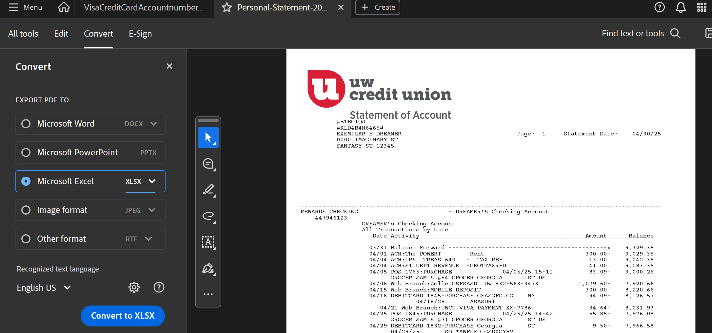

<h4>Step 2</h4>
Open the exported file in Excel/Google Sheets and it will be much easier to handle. Select the relevant data and paste it into a new sheet after clicking the New sheet '+' button near the bottom left as shown.
 
 

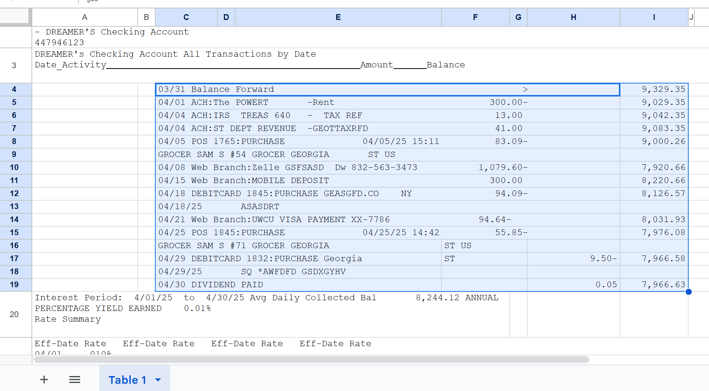
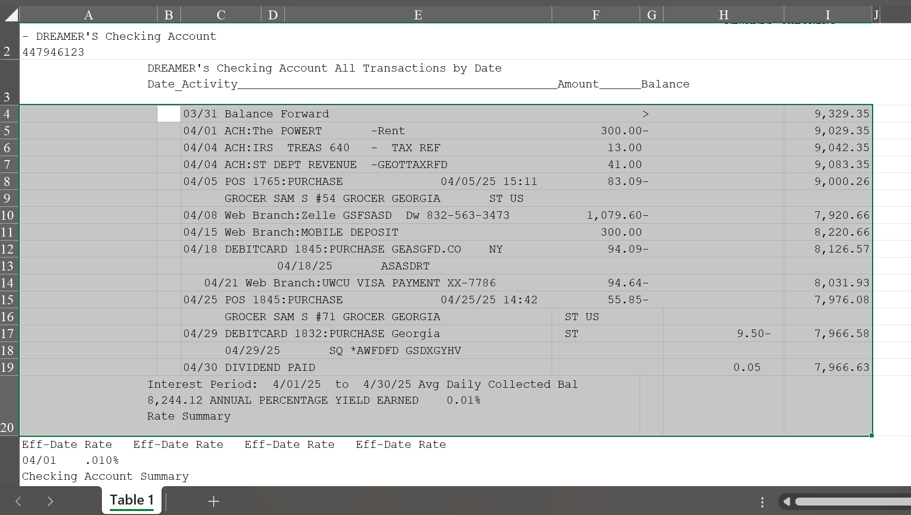

<h4>Step 3</h4>

Excel: Unmerge every cell by clicking 'Home' -> 'Alignment' -> Merge & Center dropdown -> Unmerge Cells.
 
 
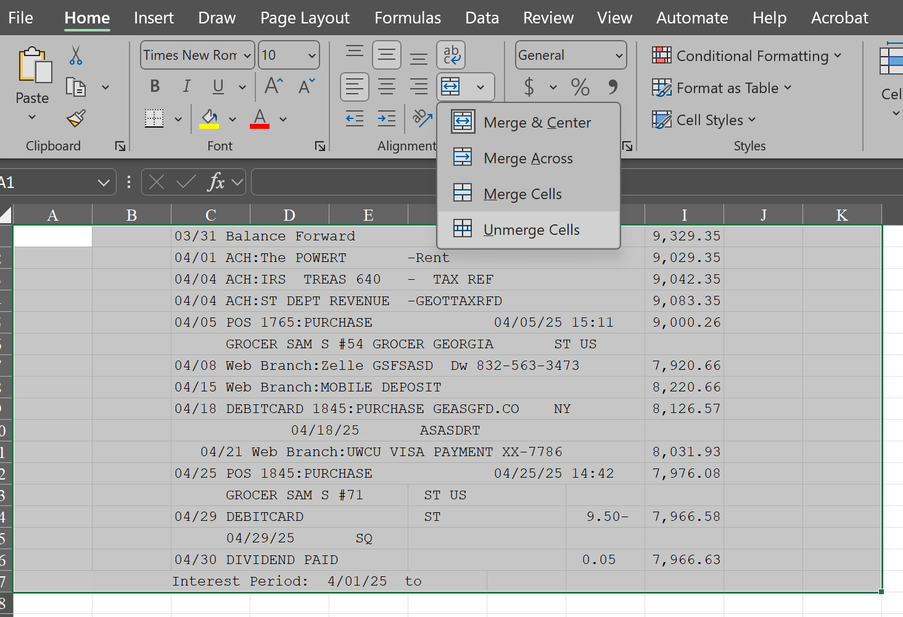

Google Sheets: Unmerge every cell by clicking 'Select Merge Type' -> 'Unmerge'. "The unmerge option will appear whenever the first (i.e., top-left) cell in the range is part of a merge, regardless of how large the range is. So if cell A1 is merged with cell B1 or cell A2, you can select the entire spreadsheet and unmerge it altogether" (Credit to LauraB 4169 on Google Docs Editors Help):
 
 

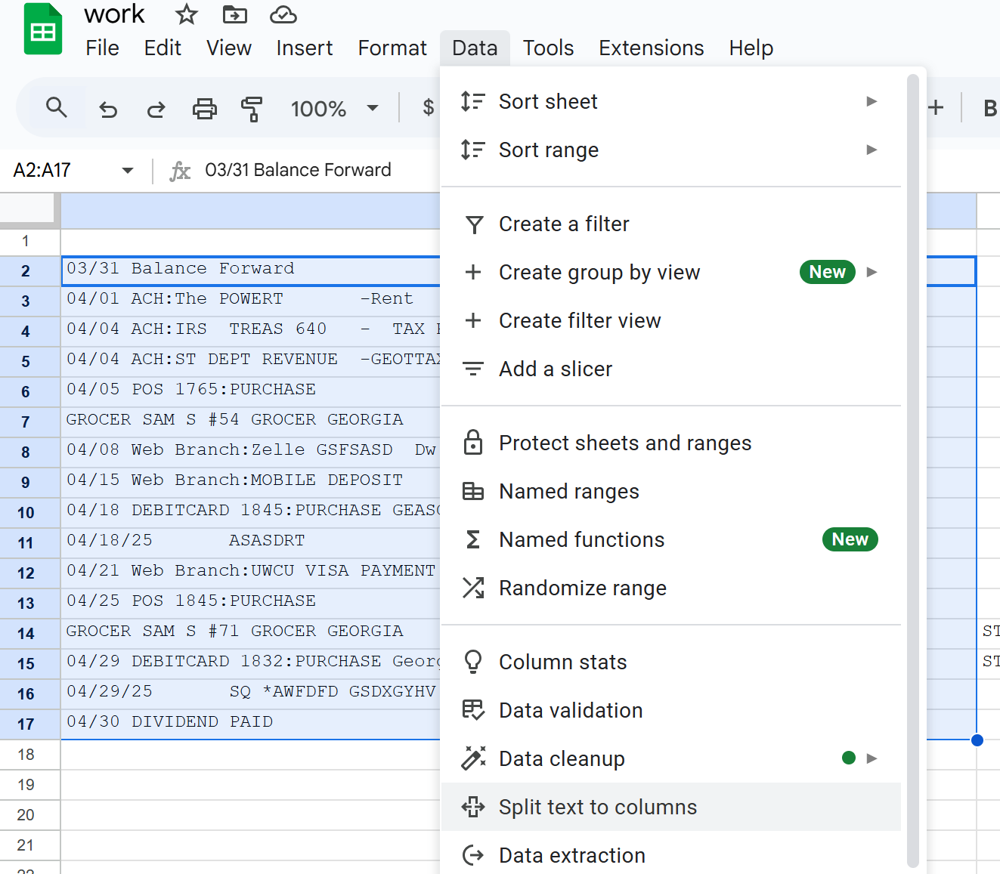

You will likely have to use separation tools, deleting, and/or moving around  to isolate the data into the proper columns. For Excel use Data -> Data Tools -> Split Text to Columns. For Google Sheets, use Data -> Split text to columns.

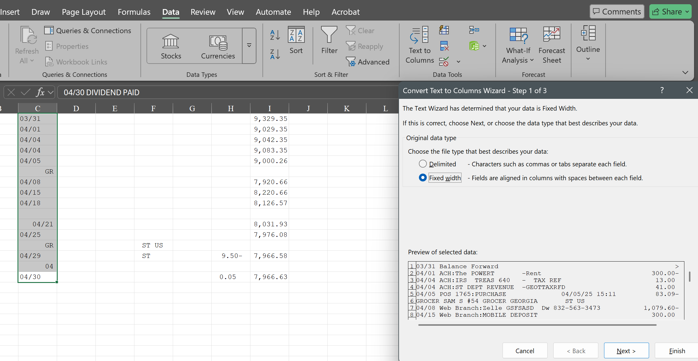
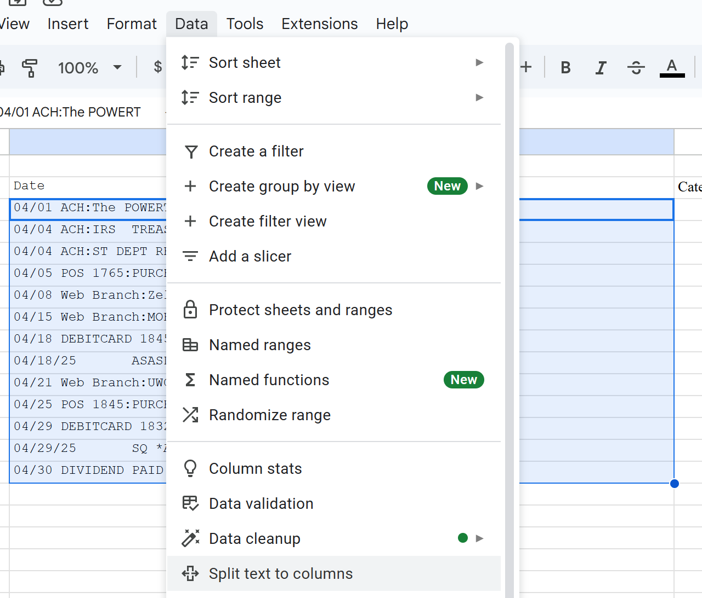

<h4>Step 4</h4>

Follow steps 5 onward from '.csv building: Credit Card Statement' if you'd like to use Excel. Continue if you want to use Google Sheets.

<h4>Step 5</h4>To easily assign categories to a column, paste a list of categories(I've provided a .csv of UWCU's categories as categories.csv) into a separate column, select the third column from the left, and go to Data -> Data Validation and then click '+ Add Rule' as shown:
 
 

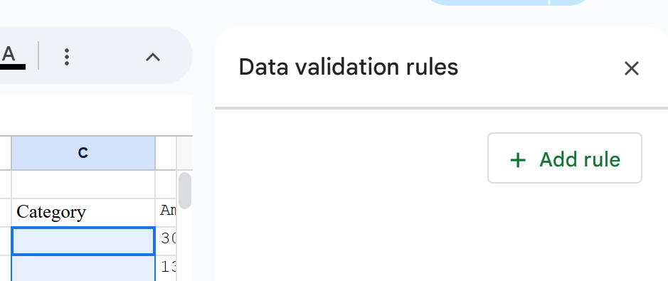

<h4>Step 6</h4>Choose 'Dropdown (from a range)' under 'Criteria:' and click the window icon(also after 'Criteria'), which will ask for a range(you can drag to select, or type it in):
 
 

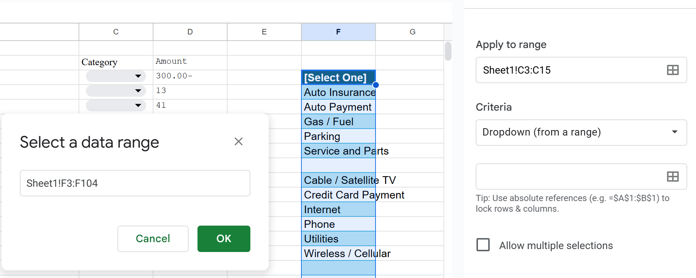

<h4>Step 7</h4>Now you can click the cell, start typing, and/or scroll through the menu:
 
 

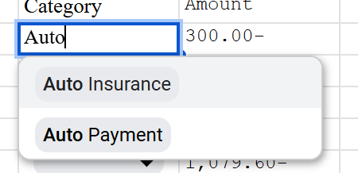

<h4>Step 8</h4>Make sure to delete the list of categories and rename the top rows to 'Date', 'Description', 'Category', and 'Amount'. It's very important the 'Date' column is formatted as a date and the 'Amount' column has proper positive and negative values.

Initially, any negative signs might appear before the number, and not after. Fix this by using the following function(make sure to replace 'H9' with the right cell):

=IF(REGEXMATCH(TEXT(H9, "0.00"), "([\d]+)\-"), LAMBDA(salary, -SUBSTITUTE(salary, "-", ""))(H9), H9)

**Note:** UWCU's credit card statements list transactions as positive values, as opposed to UWCU's Personal Statements, which list them as negative values. My program interprets negative values as spending and positive values as income.

Use the cell function in the workbook =-C1(make sure to replace 'C1' with the right cell) to flip its sign.

You should end up with a sheet as shown:
 
 

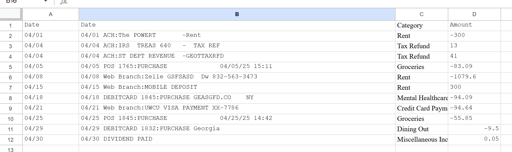

<h4>Step 9</h4>Click 'File' in the top left, and go to 'Download' -> 'Comma Separated Values (.csv)' to save the workbook as a CSV UTF-8(Comma Delimited)(*.csv) file in the folder where this notebook is:
 
 

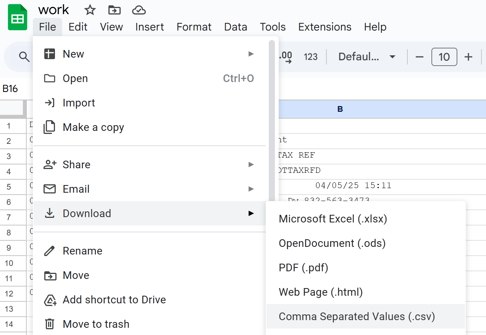

Once you've checked that your .csv is in the right format(try opening it into the Jupyter Notebook to see if it matches the format at the beginning), you're ready to start using the code!
